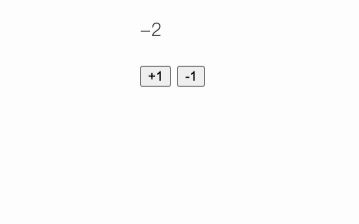

# Component 的状态和交互

Component 的 template 决定 UI 的静态模型，Component 的 JavaScript 可以为 UI 提供交互式操作(event)和数据(state)，联结二者的是 action，**可以在 template 中使用的 JavaScript 方法**， 形如：

```html
<button type="button" {{on "click" this.increment}}>+1</button>
```

## Component 的状态


状态就是 component 的属性，这些属性会随着 component 的变化而变化，有些属性会以 UI 的形式呈现给用户，也就是当属性发生变化时，UI 应该及时反映出来，这种通过跟踪属性改变 UI 状态的能力在 ember 中叫 `autotrack` ，实现 autotrack 能力的属性叫 `tracked propertiy`。

`app/components/counter.js` 
```javascript

import Component from '@glimmer/component';
import { tracked } from '@glimmer/tracking';

export default class CounterComponent extends Component {
  @tracked count = 0;
}

```

上述例子中的 `count` 中具有了 autotrack 的能力，当 autotrack 值发生改变时，对应 template 中的值也会发生变化，比如 count 的值发生改变时，template 中的值也会发生改变

`app/components/counter.hbs` 

```html

<p>{{this.count}}</p>

<button type="button">+1</button>
<button type="button">-1</button>

```

**ember 通过 this 来区分属性时来自 component argument 还是 component 自身，属于 component 自身的属性通过 this 来获取**


## 改变 Component 的状态

State 提供了 component 静态的数据，action 提供了改变 state 的能力，想要在 template 中使用 action，就需要借助 HTML modifier：


`app/components/counter.hbs`
```html
<p>{{this.count}}</p>
<button type="button" {{on "click" this.increment}}>+1</button>
<button type="button" {{on "click" this.decrement}}>-1</button>

```

`on` 是 ember 内建的一个 mofidier，用来把 event 绑定到 HTML tag。


`app/components/counter.js` 
```javascript

import Component from '@glimmer/component';
import { tracked } from '@glimmer/tracking';
import { action } from '@ember/object';


export default class CounterComponent extends Component {
  @tracked count = 0;

  @action
  increment() {
    this.count = this.count + 1;
  }

  @action
  decrement() {
    this.count = this.count - 1;
  }
}

```

而 action 就是很普通的用 `action` 装饰的 JavaScript 方法。



## 为 action 提供参数


有时候直接使用 action 并不能满足需要，还需要为 action 提供参数来实现更复杂的交互能力，ember 使用 `fn` modifier 来实现对 action 传递参数

`app/components/counter.js` 
```javascript

import Component from '@glimmer/component';
import { tracked } from '@glimmer/tracking';
import { action } from '@ember/object';


export default class CounterComponent extends Component {
  @tracked count = 0;

  @action
  change(amount) {
    this.count = this.count + amount;
  }
}
 

```

`app/components/counter.hbs`

```html
<p>{{this.count}}</p>
<button type="button" {{on "click" (fn this.change 1)}}>+1</button>
<button type="button" {{on "click" (fn this.change -1)}}>-1</button>

```

**fn 的含义就是把参数和 action 重新再包装成一个函数来使用**


## 计算属性


Computed value 是 ember 提供的一种以声明式编程的方式动态计算属性的能力，通过这种能力，如果某个 state 的改变要依赖其他 state，只要被依赖的 state 具有 autotrack 能力，那么该 state 也会在被依赖的 state 发生变化时而发生变化，下面的例子中，total 这个属性依赖 count 和 multiple，通过 get 来实现根据 count 和 multiple 的依赖计算 total

`app/components/counter.js` 

```javascript

import Component from '@glimmer/component';
import { tracked } from '@glimmer/tracking';
import { action } from '@ember/object';


export default class CounterComponent extends Component {
  @tracked count = 0;
  @tracked multiple = 1;


  @action
  double() {
    this.multiple = this.multiple * 2;
  }


  get total() {
    return this.count * this.multiple;
  }


  @action
  change(amount) {
    this.count = this.count + amount;
  }
}
 

```


`app/components/counter.hbs`

```html
<p>{{this.count}}</p>
<p>{{this.total}}</p>
<button type="button" {{on "click" (fn this.change 1)}}>+1</button>
<button type="button" {{on "click" (fn this.change -1)}}>-1</button>
<button type="button" {{on "click" double}}>double</button>

```


## 在 JavaScript 中使用 component arguments


在前文中，我们讲过在 template 中通过 `@` 来获取 component arguments，同理 JavaScript 中也提供了通过 `this.args` 来获取 argument 的能力，这就意味着 component 之间有了相互沟通的能力。


`app/components/double-it.js`
```javascript

import Component from '@glimmer/component';
import { tracked } from '@glimmer/tracking';
import { action } from '@ember/object';

export default class DoubleItComponent extends Component {
  @tracked multiple = 1;

  @action
  updateMultiple(newMultiple) {
    this.multiple = newMultiple;
  }
}

```

`app/components/double-it.hbs`
```html
<Counter @multiple={{this.multiple}} @updateMultiple={{this.updateMultiple}} />
```


`app/components/counter.js`
```javascript
import Component from '@glimmer/component';
import { tracked } from '@glimmer/tracking';
import { action } from '@ember/object';

export default class CounterComponent extends Component {
  @tracked count = 0;

  get total() {
    return this.count * this.args.multiple;
  }

  @action
  change(amount) {
    this.count = this.count + amount;
  }

  @action
  double() {
    this.args.updateMultiple(this.args.multiple * 2);
  }
}

````

