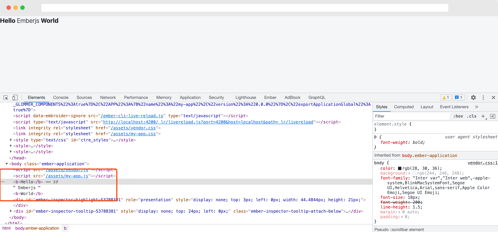

# 认识 Component 

Component 是 emberjs 中的重要概念，emberjs 的 Component 和 vuejs 以及 reactjs 等 ui-component 概念大同小异，并无本质差别，都是具有独立逻辑且可复用的 UI 单元。

## 定义 Component 

在 ember 使用 `ember generate` 命令可以快速定义一种类型，简写为 `ember g`，生成一个组件如下：

```bash
% ember g component hello 
installing component
  create app/components/hello.hbs
  skip app/components/hello.js
  tip to add a class, run `ember generate component-class hello`
installing component-test
  create tests/integration/components/hello-test.js

% ember g component world
installing component
  create app/components/world.hbs
  skip app/components/world.js
  tip to add a class, run `ember generate component-class world`
installing component-test
  create tests/integration/components/world-test.js 
```

上面的命令会生成两个 hbs 文件：

```bash
% tree app/components
app/components
├── hello.hbs
└── world.hbs
```

文件的内容是：

```html
{{yield}}
```

我们将其中的内容分别改为：

`hello.hbs`
```html
<h3>Hello</h3>
```

`world.hbs`
```html
<h3>world</h3>
```

## 使用 Component 

打开编辑器，在 `application.hbs` 中使用上面的组件

```html
<Hello/> Emberjs <World/>
```



可以看到组件的使用就如同普通的 html tag 一样，ember 约定 ember 定义的组件是以 `<>` 的形式使用，支持 self closing 形式 `</>`，组件名称风格是 Pascal 命名法，但是组件的文件名称中如果包含多个单词，则采用连字符 `-`比如，组件 `<HelloWorld/>` 对应的文件名称是：

```bash
app/components
├── hello-world.hbs
```
