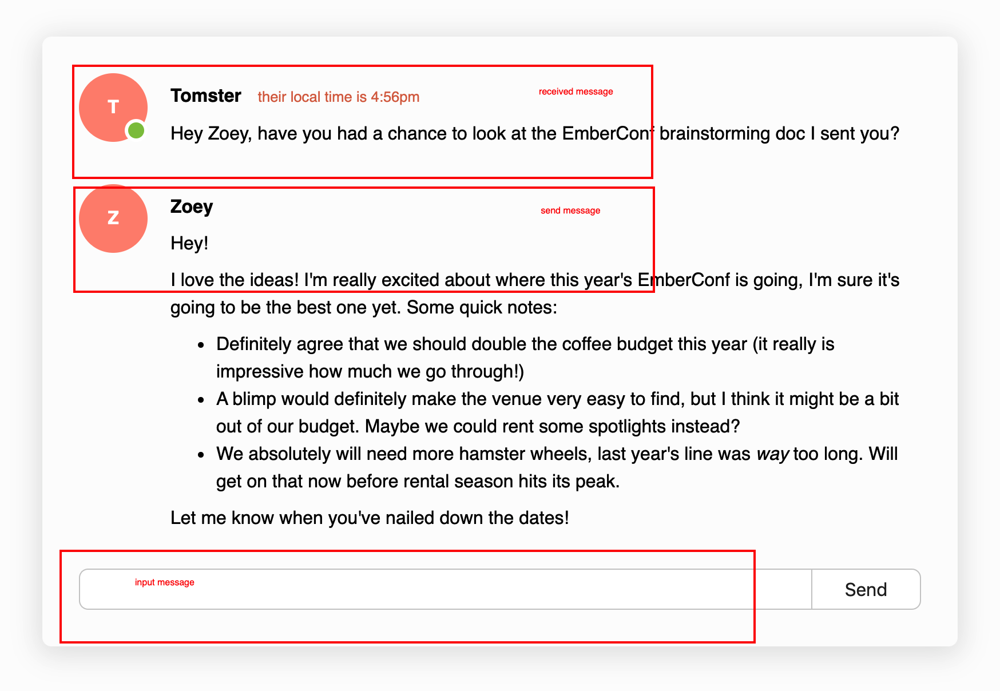

# 引入 Component 重构 html

上文中 html 内容全部在 `application.hbs` 中，这种实现方式显然不够优雅，代码的可复用性、可维护性都不好，可以利用 component 的复用能力，把 html 内容进行封装的独立使用，因此我们第一步就是要对 html 内容进行拆解，形成可复用的单元

经过拆解我们的 UI 部分可以由以下几部分组成



因此我们生成三个组件

```bash
ember g component received-message
ember g component sent-message
ember g component input-message
```

`app/components/received-message.hbs`

```html
<aside>
    <div class="avatar is-active" title="Tomster's avatar">T</div>
  </aside>
  <section>
    <h4 class="username">
      Tomster
      <span class="local-time">their local time is 4:56pm</span>
    </h4>

    <p>
      Hey Zoey, have you had a chance to look at the EmberConf brainstorming doc
      I sent you?
    </p>
  </section>
```

`app/components/sent-message.hbs`

```html

  <aside class="current-user">
    <div class="avatar" title="Zoey's avatar">Z</div>
  </aside>
  <section>
    <h4 class="username">Zoey</h4>

    <p>Hey!</p>

    <p>
      I love the ideas! I'm really excited about where this year's EmberConf is
      going, I'm sure it's going to be the best one yet. Some quick notes:
    </p>

    <ul>
      <li>
        Definitely agree that we should double the coffee budget this year (it
        really is impressive how much we go through!)
      </li>
      <li>
        A blimp would definitely make the venue very easy to find, but I think
        it might be a bit out of our budget. Maybe we could rent some spotlights
        instead?
      </li>
      <li>
        We absolutely will need more hamster wheels, last year's line was
        <em>way</em> too long. Will get on that now before rental season hits
        its peak.
      </li>
    </ul>

    <p>Let me know when you've nailed down the dates!</p>
  </section>
```

`app/components/input-message.hbs`

```html
<form>
    <label for="message">Message</label>
    <input id="message" />
    <button type="submit">
      Send
    </button>
  </form>
```

在 `application.hbs` 中使用组件

```html
<div class="messages">
  <ReceivedMessage/>
  <SentMessage/>
  <InputMessage/>
</div>
```

## 嵌套组件

为了让 UI 达到更好的复用，我们可以继续对上文中的组件进行拆分，形成更细粒度的组件，比如我们可以拆分出 SendMessage 的 UserName 以及 ReceivedMessage 的 UserName

```bash
ember g component received-message/user-name
ember g component sent-message/user-name
```

在 ember 中像 user-name 这种嵌套定义在父组件目录下的组件称之为**嵌套组件**，调用时父组件后跟`::`然后再跟组件名称

```html
<SentMessage::UserName/>
<ReceivedMessage::UserName/>
```

同理也可以对 avatar 部分的 html 进行相同拆分

```bash
ember g component received-message/avatar
ember g component sent-message/avatar
```

```html
<ReceivedMessage::Avatar/>
<SentMessage::Avatar/>
```

ember 支持**多层嵌套**，而且 ember 支持为组件定义一个`index.hbs` 且在使用的时候不需要添加 `::Index` ，因而 `app/components/received-message.hbs` 可以替换为 `app/components/received-message/index.hbs`

```bash
mv app/components/received-message.hbs app/components/received-message/index.hbs 
mv app/components/sent-message.hbs app/components/sent-message/index.hbs
```

```bash
app/
  components/
    -received-message.hbs
    received-message/
      +index.hbs
      avatar.hbs
      username.hbs
```

使用保持方式不变

```html
<div class="messages">
  <ReceivedMessage/>
  <SentMessage/>
  <InputMessage/>
</div>
```

