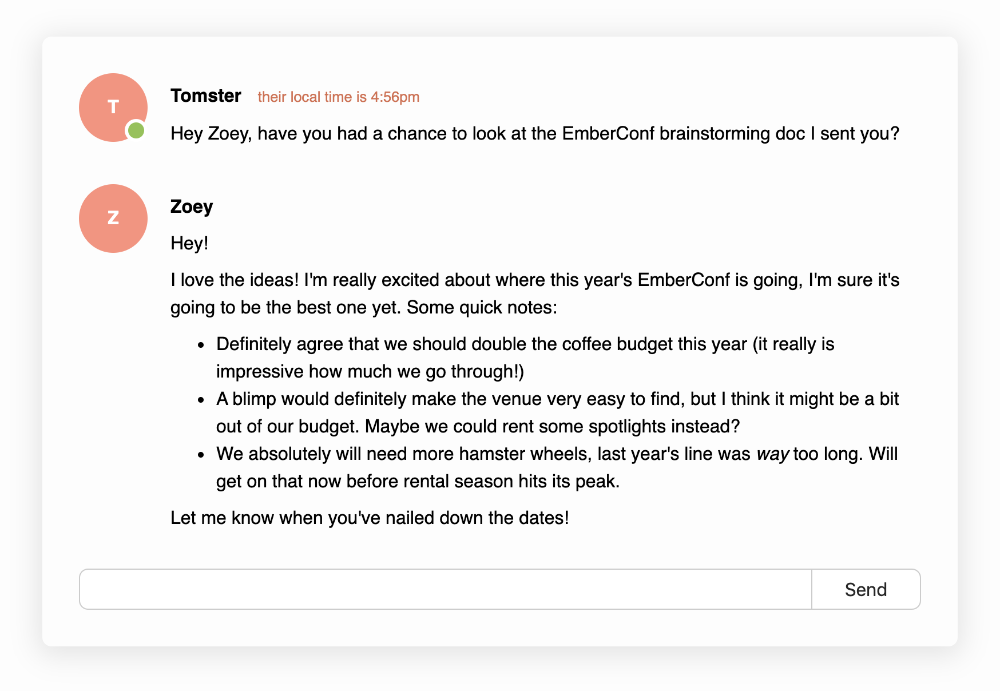

# 认识 template

ember 的 template 本质就是 html，也就意味着合法的 html 内容都会被支持，但是也有限制，比如不能在 template 中使用 `<script>`，不能使用不合法的 html tag，除此之外其他合法的 html 内容都可以使用比如：
- Web component
- SVG
- HTML comments
- White space
- ...

复制以下 html 内容到 `app/templates/application.hbs`:

```html
<div class="messages">
  <aside>
    <div class="avatar is-active" title="Tomster's avatar">T</div>
  </aside>
  <section>
    <h4 class="username">
      Tomster
      <span class="local-time">their local time is 4:56pm</span>
    </h4>

    <p>
      Hey Zoey, have you had a chance to look at the EmberConf brainstorming doc
      I sent you?
    </p>
  </section>

  <aside class="current-user">
    <div class="avatar" title="Zoey's avatar">Z</div>
  </aside>
  <section>
    <h4 class="username">Zoey</h4>

    <p>Hey!</p>

    <p>
      I love the ideas! I'm really excited about where this year's EmberConf is
      going, I'm sure it's going to be the best one yet. Some quick notes:
    </p>

    <ul>
      <li>
        Definitely agree that we should double the coffee budget this year (it
        really is impressive how much we go through!)
      </li>
      <li>
        A blimp would definitely make the venue very easy to find, but I think
        it might be a bit out of our budget. Maybe we could rent some spotlights
        instead?
      </li>
      <li>
        We absolutely will need more hamster wheels, last year's line was
        <em>way</em> too long. Will get on that now before rental season hits
        its peak.
      </li>
    </ul>

    <p>Let me know when you've nailed down the dates!</p>
  </section>

  <form>
    <label for="message">Message</label>
    <input id="message" />
    <button type="submit">
      Send
    </button>
  </form>
</div>
```

复制以下 css 到 `app/styles/app.css` ，ember 的 style 文件在 app/styles 目录中，此外 ember 也支持使用 less、sass 等扩展语言，安装对应的 ember addon 即可。

```css
body {
  max-width: 800px;
  margin: auto;
  padding: 2em;
  font-family: sans-serif;
  background-color: #fdfdfd;
}

.messages {
  display: grid;
  grid-template-columns: 80px 1fr;
  padding: 2em;
  border-radius: 0.5em;
  box-shadow: 0 0.25em 1.5em 0.25em rgba(0, 0, 0, 0.1);
}

.messages > section {
  margin-bottom: 1.5em;
  line-height: 1.5em;
}

.messages p,
.messages ul,
.username {
  margin: 0.5em 0;
}

.local-time {
  font-size: 0.8em;
  color: #da6c4d;
  font-weight: normal;
  margin-left: 10px;
}

.avatar {
  position: relative;
  border-radius: 50%;
  width: 60px;
  height: 60px;

  text-align: center;
  line-height: 60px;

  color: white;
  font-weight: bold;
  background-color: #ff907b;
}

.avatar.is-active:after {
  content: " ";
  height: 14px;
  width: 14px;
  border: solid 3px white;
  border-radius: 50%;
  background-color: #8bc34a;
  position: absolute;
  bottom: 0;
  right: 0;
}

.current-user .avatar {
  background-color: #30aba5;
}

form {
  display: grid;
  grid-column: span 2;
  grid-template-columns: 1fr 6em;
}

form > input {
  padding: 0.5em;
  border-top-left-radius: 0.5em;
  border-bottom-left-radius: 0.5em;
  border: 1px solid #cccccc;
  border-right: none;
  font-size: 1em;
}

form > button {
  border-top-right-radius: 0.5em;
  border-bottom-right-radius: 0.5em;
  border: 1px solid #cccccc;
  font-size: 1em;
}
```

浏览器会自动刷新，内容如下




