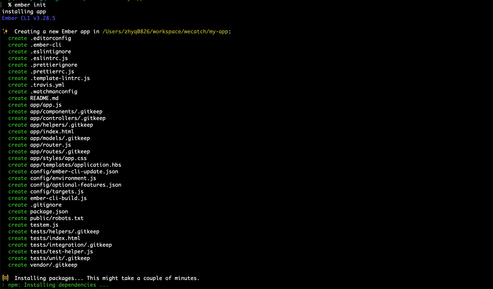

# 构建 ember 应用程序

构建 ember app 使用官方出品的构建工具 [ember-cli](https://cli.emberjs.com/release/)

```bash
npm install -g ember-cli@3.28
```

安装完成之后，创建一个空文件夹 my-app，然后进入执行初始化

```bash
mkdir my-app
cd my-app
ember init                                             
```



等待安装完成，然后启动 server

```bash
ember serve 
Build successful (13454ms) – Serving on http://localhost:4200/

Slowest Nodes (totalTime >= 5%)                                                           | Total (avg)           
------------------------------------------------------------------------------------------+-----------------------
Babel: ember-source (5)                                                                   | 4586ms (917 ms)       
Babel: @ember/test-helpers (1)                                                            | 2162ms                
BroccoliRollup (6)                                                                        | 988ms (164 ms)        
Bundler (1)                                                                               | 881ms      

```

打开浏览器访问 http://localhost:4200/


