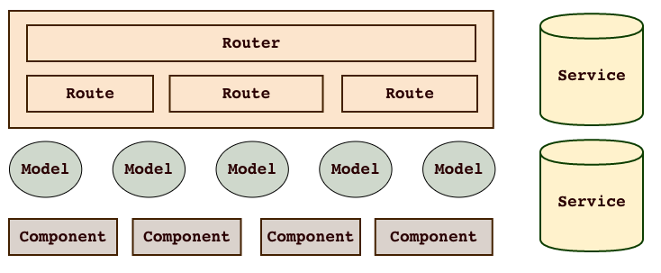

# emberjs

Emberjs 再不久的将来将逐渐移除 controller，view 这些传统 MVC 中的概念，
更多地围绕 component 以及 component 与 route，component自身的事件和数据交互来组织架构，
并引入了 service，从而简化了编程模型，这样的架构有利于清晰地划分模块职责，更容易理解数据流向和事件流向。

**图片出自:[5-essential-ember-2.0-concepts](http://emberigniter.com/5-essential-ember-2.0-concepts/)**

上图简单描述了 emberjs 中架构和基本概念：

- router
- route
- model
- controller
- service
- component

**router**

router 负责组织route，并处理 route 之间的层级关系

**route**

简单理解就是一个 url

**model**

在 emberjs 的官方中，model 层是由 ember-data 负责的，
其实 emberjs 的 model 可以是任意的 emberjs 对象、数组或 promise。由于 ember-data 的复杂性以及对数据的强制规范，wecatch 在实践中都是自己实现 ORM 层，处理简单，数据交互也直观。

**service**

service 是一个单实例 ember 对象，负责为不同的 ember object 提供服务，简单理解就是一种对象之间的交互和通信手段

**component**

具有数据和事件的 UI 组件

**controller**

controller 现在的作用负责把连接 route 和 template，不过由于大部分逻辑都可以使用 component 封装，所以 controller 的作用在不断弱化

----------

**本文部分参考[5-essential-ember-2.0-concepts](http://emberigniter.com/5-essential-ember-2.0-concepts/)**
