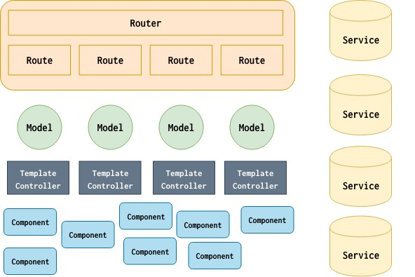

# 介绍

Emberjs 是一个 JavaScript 框架，可以用来构建非常复杂的 web 应用，emberjs 的设计理念是**约定大于配置**，本身具有固定的开发模式以及完备的开发工具，一旦掌握，生成效率奇高。

## 基础概念和架构

**图片出自:[5-essential-ember-2.0-concepts](https://emberigniter.com/5-essential-ember-concepts/)**

上图描述了 emberjs 中架构和基本概念：

- router
- route
- model
- controller
- service
- component

### Router

router 负责组织 route，并处理 route 之间的层级关系，route 的 manager。

### Route

route 就是 web 的路由，优秀的 web 应用总是从良好的路由设计开始的。

### Model

emebr 中的数据对象，可以是任意的 JavaScript 对象、数组或 promise，ember 提供了 ember-data 来处理所有与数据相关的事情。

### Service

service 是一个单实例 ember 对象，在 emebr 应用中负责全局性的事务处理，比如登录会话信息等。

### Component

类似 react 和 vuejs 中的 component，完整的包含了渲染 UI 所需要的状态、HTML以及事件交互。

### Template & Controller

Controller 连接 route 和 template，在对应的 template 中渲染 route 中的 model 数据。

