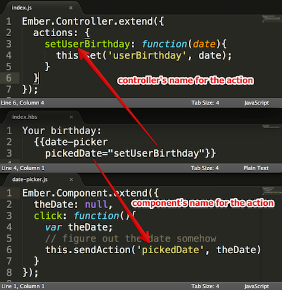

# [How Ember.js Components communicate using sendAction](http://coryforsyth.com/2014/09/24/communicating-with-ember-js-components-using-sendaction/)

Components and sendAction
Some people find the use of `sendAction` in Ember components a bit confusing. In this post I'll go over how Ember component use `sendAction` to communicate with controllers and routes, with some examples of common pitfalls.

(P.s. For more info on many other Ember pitfalls see the Emberfest 2014 Presentation by @alexspeller. It inspired me to write this post.)

There are several ways using actions in an Ember component is different than in a route or controller:

1. In an Ember component, unlike an Ember controller or route, you use `sendAction`. (In a route or controller you would just use the `send` method.)

2. In an Ember component, unlike an Ember controller or route, if you call `sendAction` and there is no handler for that action, no error is raised. (In a route or controller Ember would complain with a error message that starts with: "Nothing handled the action:".)

3. The component's `sendAction` is intended to send an action using the component's name for that action. The outer context (controller or route) might have a different name for the same action. The handlebars template is the place to specify the name of the action on the controller/route that will be invoked when the component calls `sendAction` with its name for that action.


## Example: {{date-picker}}

As an example, say we have an imaginary {{date-picker}} component. Its semantic name for the action that it sends when a user has selected a date is "pickedDate". The controller context in which this component is being used will have its own name for the action it wants to take when the {{date-picker}} component sends it its "pickedDate" action. In this example, we are using the {{date-picker}} to allow a user to select their birthday, so the action on the controller is "setBirthday". We connect the "pickedDate" component's action to the controller's "setBirthday" action in the template:

```html

    {{! index.hbs}}

    Pick a date:
    {{date-picker pickedDate="setBirthday"}}

```

Note that the action that the component exposes (`pickedDate`) is on the left side of that assignment, and it is unquoted. The action name on the controller is quoted: it is the literal string value "setBirthday". The way I think of it is that `pickedDate` is a property of the component, and we want to set that component's property to the name of an action on the controller. We have to put quotes around "setBirthday" in the template because we actually do want the `pickedDate` property to equal the literal string "setBirthday". If there were no quotes around "setBirthday", Ember would treat it as a property and replace it with the value of a property named `setBirthday` on the controller, which wouldn't be what we want

And what does the code inside the component look like, to send this action to its target? Here is a stripped-down example, leaving out the code that the component might use internally to draw a calendar, respond to user clicks/keypresses, etc. We'll assume that that part of the component works and when the user has finished selecting a date the component internally triggers its own action `donePickingDate`. In that case, the code looks like this:

```
// components/date-picker.js
 
export default Ember.Component.extend({
  actions: {
 
    // this is the action that the component handles
    //*internally* when the user has picked the date.
    // The name of this action could be anything that
    // the component author chooses, since it won't
    // be exposed to the outside world.
    donePickingDate: function() {
 
      // we assume that some other code in the component
      // has correctly set the `theDate` property
      // by this point.
      var theDate = this.get('theDate');
 
      // Here we communicate to the *outside* of
      // the component, sending our semantically-named
      // "pickedDate" action to the outside world.
      //
      // In index.hbs we had specified that the `pickedDate`
      // property of this component equals "setBirthday".
      this.sendAction('pickedDate', theDate);
    }
  }
});


```


It can be complicated to keep the various actions, action names and sendAction calls straight. It begins to get clearer if we start by remembering that a component is intended to be isolated from the rest of our application. It can be easy to forget this because most of the time we use components we are writing them ourselves, but in an ideal world we would have many third-party components that we could drop into our Ember app which we would treat as black boxes.

So, if we consider our component (whether we wrote it our not) to be a black box, we can think of it as having an "action API surface", by which I mean an action or set of actions that it provides to us, the consumers of this component. When using the component, it is our responsibility to specify how our app should respond to each of the action(s) the component exposes. This is what we are doing in our template when we specify `pickedDate="setBirthday"`. We wouldn't want the {{date-picker}} component to need know anything about what we intend to do with the date that the user has selected. It just sends an action that a user picked the date, and the outside context does the right thing with that date. Otherwise we'd need a different version of the component for every context we wanted to use it in ({{date-picker-for-birthday}} that sends 'setBirthday' action, {{date-picker-for-due-date}} that sends 'setDueDate' action, etc.), and we'd lose the reusability that components are designed for.

tl;dr: The component calls `sendAction` with its preferred name for the action, and Ember translates this into the controller's preferred name for the action, which was specified (as a string) in the template.





The way Ember does this translation internally is when the component calls `this.sendAction('pickedDate', theDate)`, Ember looks up the value of the `pickedDate` property. In this case that value is the literal string "setBirthday". Ember then invokes that action on the controller. Because of the way `sendAction` works, if there is no handler for the "setBirthday" action on the controller or its parent route(s), there will be no error raised and Ember will silently do nothing.

It's worth noting that the action that the component sends is distinct from the properties in its own `actions` hash. It can be confusing because in most cases, the name of the action that the component sends will not be very prominent in the component's own code. It will usually only appear that one time, as a string, in the component's `this.sendAction('pickedDate', ...);` call. The component must rely on the template having set a value for `pickedDate`. Couple this with the fact that `sendAction` will not raise an error, and it's easy get confused when using a component. Consider this template and component:


```
{{! index.hbs}}

Your birthday?
{{date-picker}}

```


```
// component/date-picker.js
Ember.Component.extend({
  ...
  actions: {
    donePickingDate: function(){
      ...
      this.sendAction('pickedDate', theDate);
    }
  }
});

```

What happens when the user has finished selecting a date? Nothing. No error will be raised. The component will happily send an action named `undefined` (because the value of its `pickedDate` property was never specified in the template), and since there is no handler for an action named `undefined` in the controller or route hierarchy, `sendAction` will silently ignore it and do nothing.

## Component Reuse

If you consider using the same component more than once in a template, you can see another reason that it makes sense to specify the controller's action name in the template. For example, say we have a template where a user is trying to pick her birthday *and* set a deadline date for a to-do item:

```
{{! index.hbs}}

What is your birthday?
{{date-picker pickedDate="setBirthday"}}

When is this to-do due?
{{date-picker pickedDate="setDueDate"}}

```

In this case, we have two different actions on the controller ("setBirthday" and "setDueDate") that we want to handle the date picker's `pickedDate` action in two different parts of the template. The component code is the same: in both cases, it will just call `this.sendAction('pickedDate', ...)`, and Ember will translate that into the correct action on the controller depending on which part of the template the user was interacting with.

## sendAction's default action name: "action"

So far our example using {{date-picker}} has focused on it having a semantically-named "pickedDate" action. Accordingly, we've been having the date-picker component explicitly name that action in its code when we call `this.sendAction('pickedDate', ...)`. However, since many components have a clear single action that they take, Ember provides a convenience by defaulting to sending an action named "action". You could see how this would be convenient if you imagine we are picking components out of a library of potential components. We have {{date-picker}} and {{date-and-time-picker}} and {{time-picker}}. Rather than each of them implementing a different named action ("pickedDate", "pickedDateAndTime", "pickedTime"), the convention is that they will all simply send an action named "action", and so we can specify in our template what action each should take:


```
{{! index.hbs}}
 
Birthday?
{{date-picker action="setBirthday"}}
 
When do you wake up?
{{time-picker action="updateWakeTime"}}
 
When is this to-do due?
{{date-and-time-picker action="setDueDate"}}
```


In theory, since "action" is the default action name for `sendAction`, our component code would simply call `this.sendAction(theDate)` without specifying the action name. However, there's an important caveat which is that when you are sending a default action that includes a parameter(s), Ember has no way of telling the difference between this and sending an action by its name. So even if you are sending the default action, if you are including a parameter(s), you must still use "action" as the first parameter: `this.sendAction('action', theDate)`.
